# 01-C-BASIC Snippets

## 01-hello-world

### hello.c


```c

#include <stdio.h>

int main()
{

	printf("Hello World\n");
	return 0;
	
}

```
### output

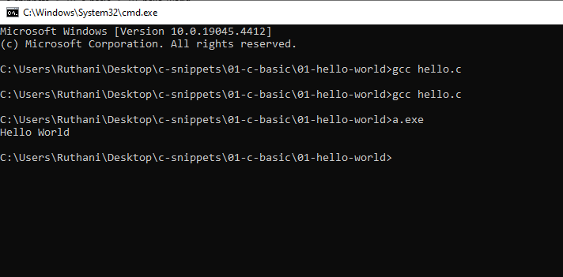

## 02-simple-math

### math1.c

```c

#include<stdio.h>

int main(){

	int x = 10;
	int y = x / 2;

	printf("%d",y);
	return 0;

}

```
### output

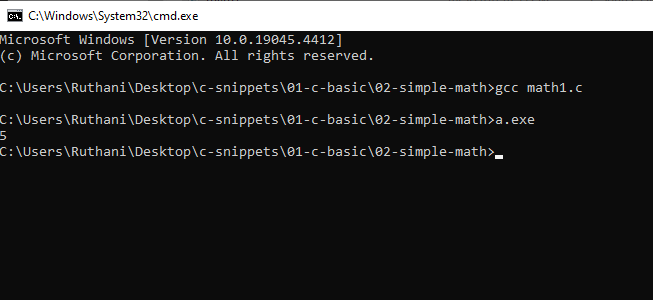

## 03-scanf

### scan.c

```c

#include <stdio.h>

int main(){

	int radious;
	printf("Enter a radious ");
	scanf("%i",&radious);
	printf("Tha Entered radious is %i\n",radious);
	return 0;


}

```
### output

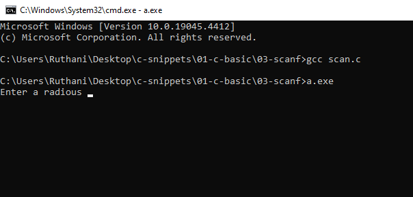

## 04-radious

### radious.c

```c

#include <stdio.h>

int main()
{


	int radious;
	printf("Please Enter a radious %s\n");
	scanf("%i",&radious);

	double area = 3.14159 * (radious * radious);
	printf("The area of a circle is  %f\n", area);
	return 0;


}

```
### output

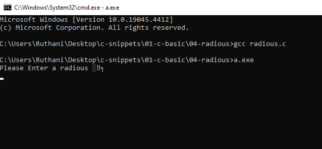

## 05-type-casting

### typeCast.c

```c

#include <stdio.h>

int main()
{

	printf("The number of eggs for the day: ");
	int eggs;
	scanf("%i",&eggs);

	double dozen = (double) (eggs/12); // we cast the value tp double. 
	printf("You have %f dozen eggs.\n",dozen);
	return 0;

}

```
### output


## 07-scientific-notation

### float.c

```c

 #include <stdio.h>

int main(){

	int dogs = 2.5e4;
	printf("%i",dogs );
	return 0;


}
```
### output

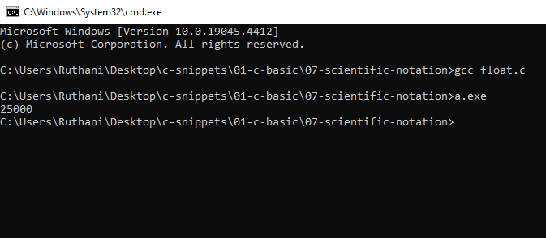

## 08-char

### char.c

```c

#include <stdio.h>

int main(){

	printf("Enter a char value %s\n");
	char myChar;
	scanf("%c",&myChar);
	printf("%c\n",myChar);
	return 0;

}

```
### output

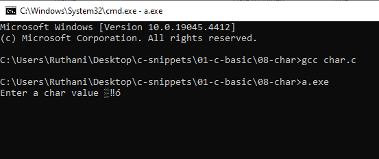

## 09-bool

### bool.c

```c

#include <stdio.h>

int main(){

	_Bool isJokerHacker = 200;

	printf("Is joker is hacker ? 1 yes 0 no %i\n",isJokerHacker);
	return 0;
}

```
### output

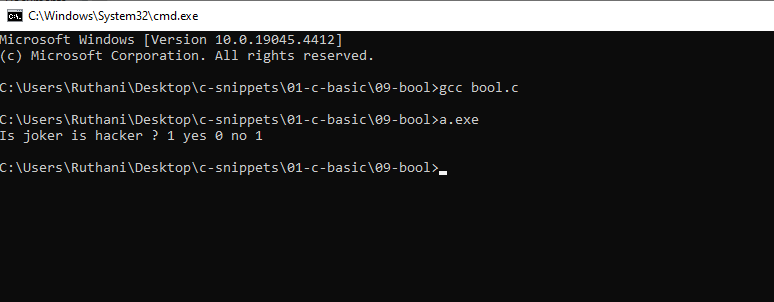

## 10-bool-with-stdbool-h

### boolLib.c

```c
#include <stdio.h>
#include <stdbool.h> //This library will make the bool works very easliy.

int main(){

	bool joker = true; // true will make the joker varibale to  have one.

	printf("%i\n", joker + 10);
	return 0;

}
```
### output

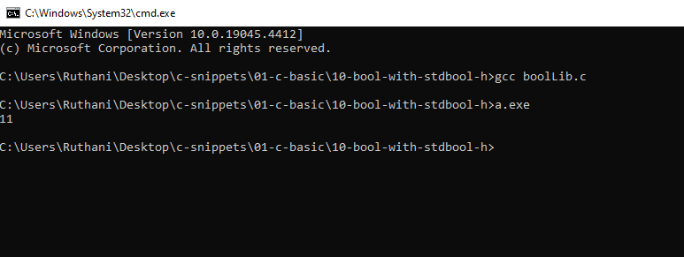

## 11-module

### module.c

```c

#include <stdio.h>

int main(){

	int picesOfPizza = 5;
	int numberOfEaters = 2;

	int leftOver = picesOfPizza % numberOfEaters;

	printf("%i\n",leftOver );

}

```
### output

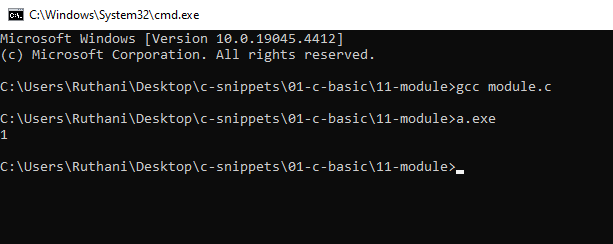

## 12-unary

### un.c

```c

#include <stdio.h>


int main(){

	int money = 25;
	int bill = 15;
	int total = money - - bill; //This is unary. -- = +
	printf("%i\n",total);
	printf("%i\n",bill);


}

```
### output

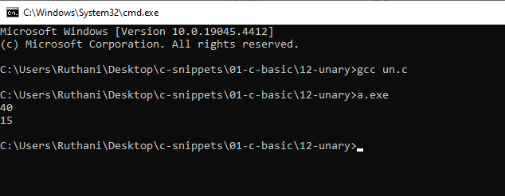

## 13-increment

### inc.c

```c

#include <stdio.h>

int main(){

	int pizzaToEat = 100;
	pizzaToEat++;
	printf("%i\n",pizzaToEat);

}

```
### output

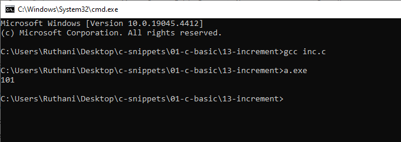