# 02-codecamp Snippets

## 01-hello-world

### Program.c

```c
#include <stdio.h>

int main(){

	printf("Hello World\n");
	return 0;

}

```
### output


## 02-variable

### Program.c

```c

#include<stdio.h>

int main(){

	char name[] = "kuna";
	int a=10;

	printf("Hello, My name is %s\n",name);
	printf("My age is %d\n",a);

	return 0;


}

```
### output


## 03-data-types

### Program.c

```c

#include <stdio.h>

int main(){

	int a=10; //Int stores whole numbers.
	double d=10.5; // point numbers.
	char onev= 'A'; //Stores only one character.

	return 0;

	//These are the basic data types in c.

}

```
### output


## 04-printf

### Program.c

```c

#include <stdio.h>

int main(){


	printf("My Favoite %s is %d \n","number",500 );
	
}

```
### output


## 05-numbers

### 01-example

#### Program.c

```c

#include<stdio.h>

int main(){

	printf("%f\n", 85.5/2);
	return 0;

}

```
#### output


### 02-example

#### Program.c

```c

#include<stdio.h>
#include<math.h>


int main(){


	printf("%f", pow(2,8) ); 
	//sqrt() get the squre root of number.
	//celi() next heighst number.
	//floor() round the number.
	return 0;

}

```
#### output


## 07-const

### Program.c

```c

#include <stdio.h>

int main(){

	const int num = 10;//constant variable cannot be changed.
	printf("%d\n",num );
	return 0;
}

```

### output


## 08-scanf

### 01-int

#### Program.c

```c

#include<stdio.h>

int main(){

	int age;
	printf("Enter your age:");
	scanf("%d",&age);//& means is pointer.
	printf("You are %d years old\n",age );
	return 0;
}


```

#### output


### 02-char

#### Program.c

```c

#include<stdio.h>

int main(){

	char name[10]; //10 character length char variable.
	printf("Enter your name:\n");
	scanf("%s",name); // Do not need to used pointer for char variable.
	printf("Your name is %s\n",name);
	return 0;
}

```

#### output


## 09-fgets

### Program.c

```c

#include<stdio.h>

int main(){

	char name[10]; //10 character length char variable.
	printf("Enter your name:\n");
	fgets(name,10,stdin); //name is the variable. 10 is the length.
	//fgets can be used to get multiple words with space.
	printf("Your name is %s\n",name);
	return 0;
}

```

### output


## 10-add-two-numbers

### Program.c

```c

#include<stdio.h>

int main(){

	int num1;
	int num2;
	printf("Enter first number.\n");
	scanf("%d", &num1);
	printf("Enter secound number\n");
	scanf("%d", &num2);

	int total = num1+num2;

	printf("The total value is %d \n",total);

	return 0;

}

```

### output


## 11-exercise

### Program.c

```c

#include <stdio.h>

int main(){

	char color[20];
	char pluralNoun[20];
	char celebrity[20];

	printf("Enter a color\n");
	scanf("%s",color);

	printf("Enter a pluralNoun\n");
	scanf("%s",pluralNoun);

	printf("Enter a celebrity\n");
	scanf("%s",celebrity);

	printf("Roses are %s\n",color);
	printf("%s are blue\n",pluralNoun);
	printf("I love %s\n",celebrity);

	return 0;

}


```

### output


## 12-array

### 01-example

#### Program.c

```c

#include<stdio.h>

int main(){


	int numbers[] ={2,4,16,32,64,128,256};

	printf("%d\n",numbers[0] );

	//modify the 0 element.

	numbers[0] = 200; // replacement took palce.

	printf("%d\n",numbers[0]);

	return 0;

}


```

#### output


### 02-example

#### Program.c

```c

#include<stdio.h>

int main(){

	int arr[5];

	arr[1]=10;
	arr[0]=1;
	printf("%d\n", arr[0]);
	printf("%d\n",arr[1] );
	return 0;

}


```

#### output


## 13-functions

### 01-simple-function

#### Program.c

```c

#include <stdio.h>
#include <stdlib.h>

int main(){

	exe();
	return 0;

}


void exe(){


	printf("hello\n");

}


```

#### output

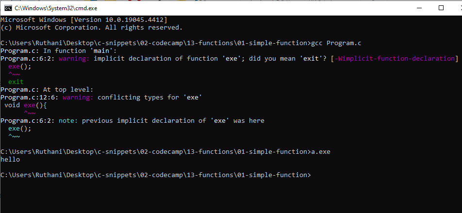

### 02-parameter-function

#### Program.c

```c

#include <stdio.h>
#include <stdlib.h>

int main(){

	sayHi("guna",5);
	return 0;

}


void sayHi(char name[],int age){

	printf("hello %s. and your age is %d\n",name,age);
}


```

#### output

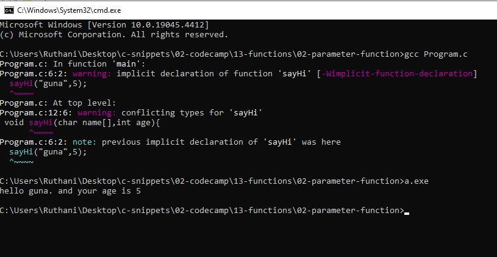

### 03-return-function

#### Program.c


```c

#include <stdio.h>
#include <stdlib.h>

double cube(double num){

    return  num * num * num;

}


int main(){

    printf("%f",cube(10));
    return 0;
}


```

#### output

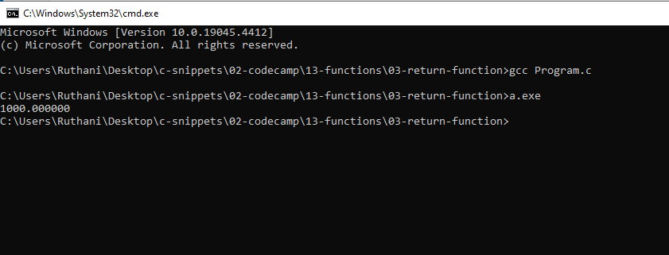

### 04-functuib-signature

#### Program.c

```c

#include <stdio.h>
#include <stdlib.h>

double cube(double num); // This is called function sigature.

int main(){

    printf("%f",cube(10));
    return 0;
}

double cube(double num){

    return  num * num * num;

}


```

#### output

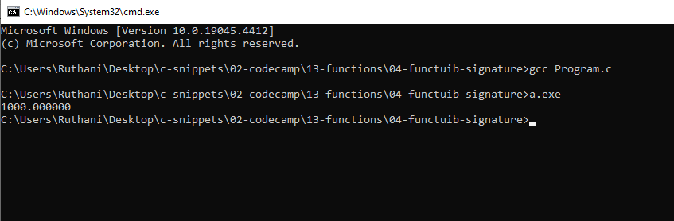

## 14-if-statement

### 01-max-number

#### Program.c

```c
#include <stdio.h>
#include <stdlib.h>

int max(int num1,int num2){

	int result;
	if(num1>num2){

		printf("Number one is greater than number two\n");


	}else {


		printf("Number two is greater number two\n");

	}
}

int main(){


	max(1,2);


	return 0;

}

```

#### output

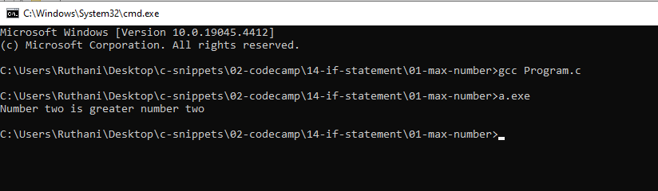


## 15-exercise

### Program.c

```c

#include <stdio.h>
#include <stdlib.h>

int main(){

	double num1;
	double num2;
	char op;

	printf("Enter a number\n");
	scanf("%lf",&num1);

	printf("Enter the operator\n");
	scanf(" %c",&op);
	printf("Enter a number\n");
	scanf("%lf",&num2);


	if(op == '+'){

		  printf("The answer is %f",num1 + num2);

	}else if(op == '-'){

		printf("%f\n", num1-num2);

	}else if(op == '*'){

		printf("%f\n",num1*num2);

	}else if (op == '/'){

		printf("%f\n",num1/num2);


	}else{

		printf("Invalid operator.\n");

	}

		return 0;
}


```

### output

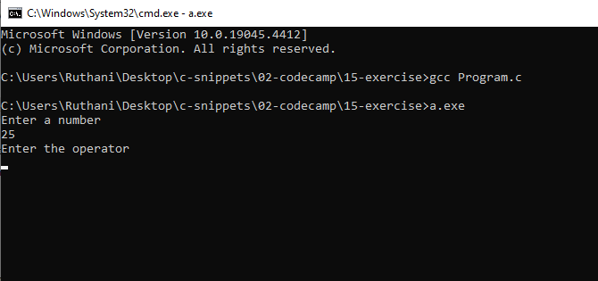

## 16-switch

### Program.c

```c

#include <stdio.h>
#include <stdlib.h>

int main(){

    char grade = 'B';

    switch(grade){

    case 'A':
        printf("You have entered A");
        break;
    case 'B':
        printf("You have entered B");
        break;
    case 'C':
        printf("You have entered C");
        break;

    default:
        printf("Wrong");
        break;

    }

    return 0;
}

```

### output


## 17-struct

### Program.c

```c

#include <stdio.h>
#include <stdlib.h>


struct Student{

    char name[50];
    int age;
    double gpa;

};

int main(){


    struct Student student1;
    student1.age=22;
    student1.gpa = 3.2;
    strcpy(student1.name,"guna");


    struct Student student2;
    student2.age=66;
    student2.gpa=5.5;
    strcpy(student2.name,"Joker");

    printf("The name of the student 1 is %s \n",student1.name);
    printf("The age of the student 1 is %d\n",student1.age);
    printf("The GPA of the student 1 is %f \n",student1.gpa);

    printf("---------------------------------------------------\n");

    printf("The name of the student 2 is %s\n",student2.name);
    printf("The age of the student 2 is %d\n",student2.age);
    printf("The GPA of the student 2 is %f\n",student2.gpa);


    return 0;
}


```

### output

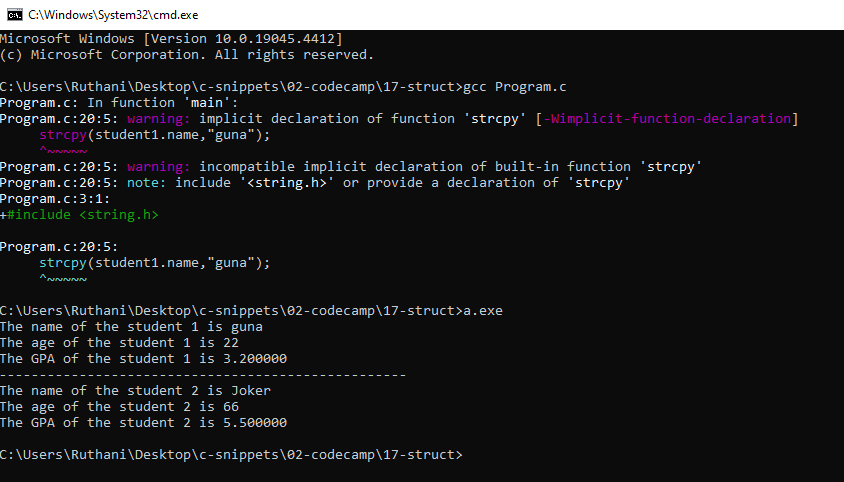

## 18-while-loop

### Program.c

```c

#include <stdio.h>

int main(){

    int i=0;

    while(i<=100){

        printf("%d\n",i);

        i++;
    }

    return 0;

}


```

### output

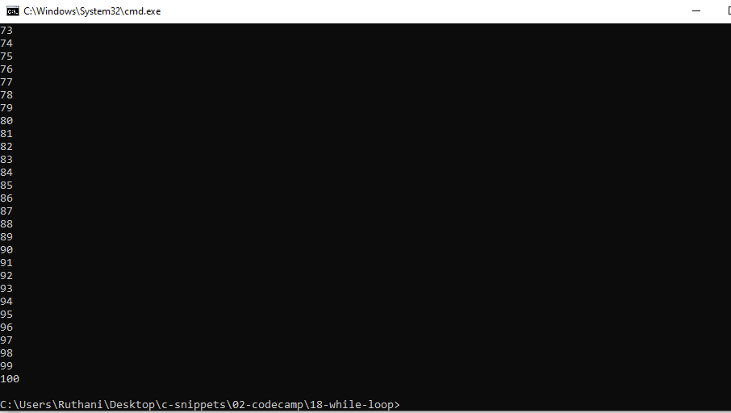

## 19-do-while

### Program.c

```c

#include <stdio.h>

int main(){

    int index = 0;

    do{

        printf("%d\n",index);
        index++;

    }while(index<100);

    return 0;

}


```

### output

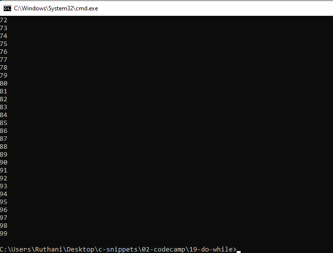

## 20-execrise

### Program.c

```c

#include <stdio.h>


int main(){

    int secertNum=2;
    int guess;
    int guessCount=0;
    int limitGuess=3;
    int outOfGuess=0;

    while(guess!=secertNum && outOfGuess==0){

        if(guessCount < limitGuess){

            printf("Enter a number.");
            scanf("%d",&guess);
            guessCount++;

        }else{


            outOfGuess=1;

        }

    }

    if(outOfGuess==1){

        printf("You have run out of changes");

    }else{

        printf("You have won.");
    }

    return 0;

}


```

### output

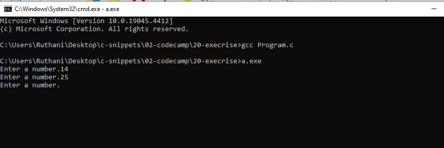

## 21-for-loop

### 01-forward

#### Program.c

```c

#include <stdio.h>

int main(){


    for(int index=0;index<=100;index++){

        printf("%d\n",index);

    }

    return 0;
}


```

#### output

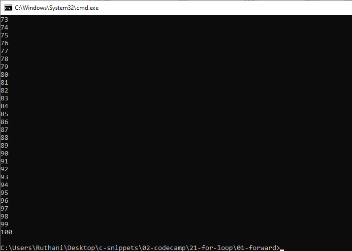

### 02-backward

#### Program.c

```c
#include <stdio.h>

int main(){


    for(int index=100;index>=0;index--){

        printf("%d\n",index);

    }

    return 0;
}

```

#### output

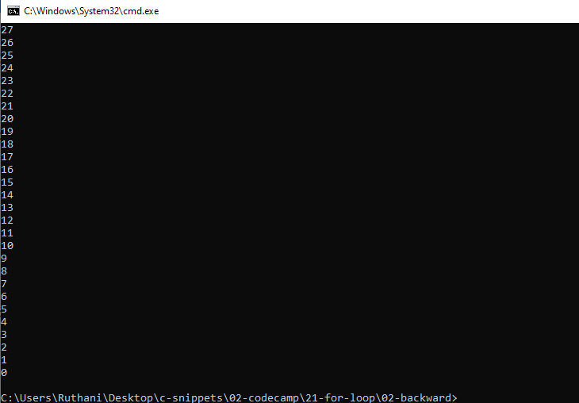

### 03-even-and-odd-number

#### Program.c

```c
#include <stdio.h>

int main(){


   for(int o=1; o<=100; o++){

    if(o%2==0){


        printf("%d is even Number \n",o);

    }else{

        printf("%d is odd Number \n",o);

    }

   }

    return 0;
}


```

#### output

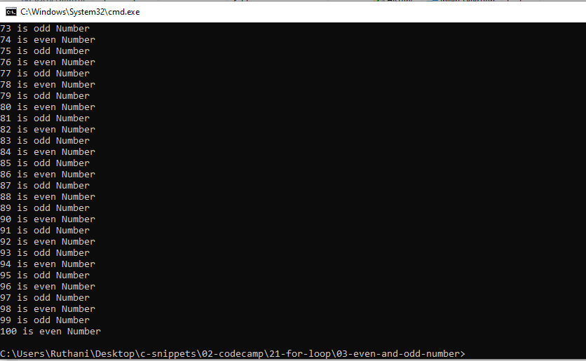

### 04-for-loop-with-array

#### Program.c

```c

#include <stdio.h>

int main(){


    int numbers[] = {2,5,6,8,2,6,8,55,32};

    for(int s=0;s<=8;s++){

        printf("%d\n",numbers[s]);
    }

  return 0;

}


```

#### output

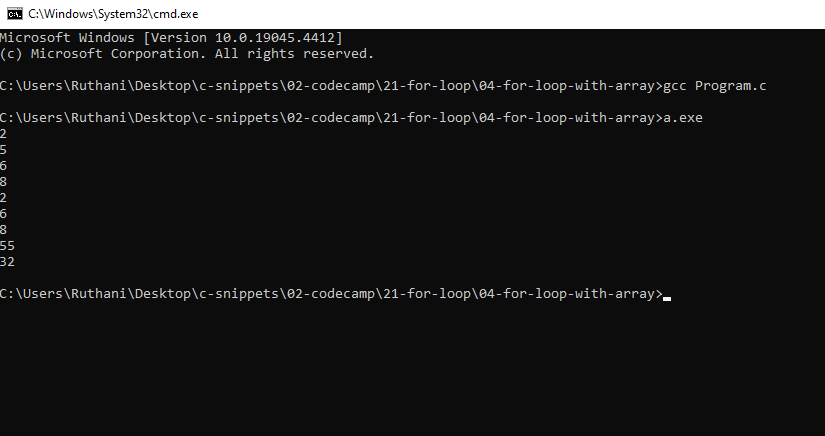


## 22-2d-array-with-nested-for-loop

### Program.c

```c
#include <stdio.h>

int main(){

    int numbers[3][2]=
    {
        {1,2},
        {3,4},
        {5,6}
    };

    int i , j;

    for(i=0;i<3;i++){

        for(j=0;j<2;j++){

            printf("%d,",numbers[i][j]);

        }

        printf("\n");

    }

    return 0;
}


```

### output

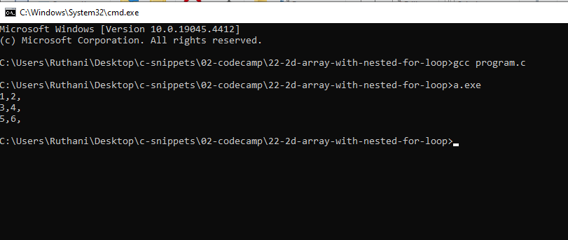

## 23-memory-address

### Program.c

```c

#include <stdio.h>

int main(){

    int age = 22;
    double gpa = 20.5;
    char grade = 'A';

    printf("Age: %p \nGPA: %p\nGrade: %p",age,gpa,grade);


    return 0;

}

```

### output

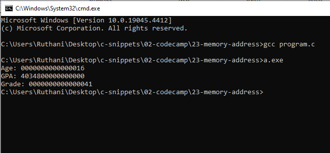

## 24-pointers

### Program.c

```c
#include <stdio.h>

int main(){


    int age = 30;
    int * pAge = &age;  //Pointer variable. This stores the memory address of the age variable.

    double gpa = 3.4;
    double * pGpa = &gpa;

    char grade = 'A';
    char * pGrade = &grade;


    printf("Age memory address is: %p ",&age); //$age is the pointer.
    //%p means, we are telling that to print the memory address of the age.
    return 0;
}


```

### output

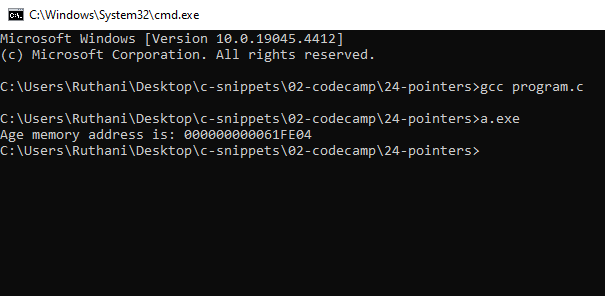

## 25-dereferencing-pointer

### Program.c

```c

#include<stdio.h>

int main(){

    int age = 30;
    int *pAge = &age;

    printf("%d",*pAge); //we have to use the * for this.
    return 0;

    //Dereferencing a pointer means getting the value that is stored in the memory location pointed by the pointer.
}


```

### output

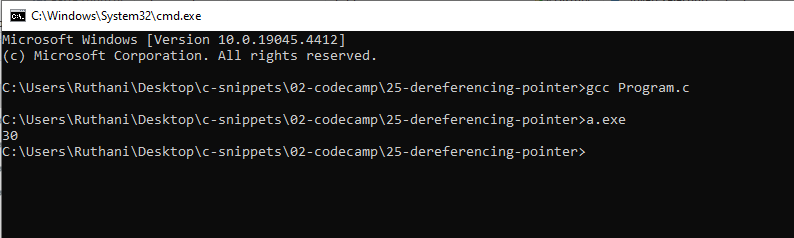

## 26-file-write

### Program.c

```c

#include <stdio.h>
#include <stdio.h>

int main(){

    FILE * fpointer = fopen("Employee.txt","w");
    fprintf(fpointer,"Kuna, Software Engineer,\nJoker is a hacker");

    fclose(fpointer);
    return 0;

}


```

### output

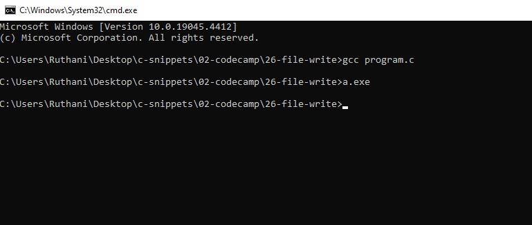

## reading-files

### Program.c

```c
#include <stdio.h>
#include <stdio.h>

int main(){

    char line[255];
    FILE * fpointer = fopen("Employee.txt","r"); //r means reading.
    fprintf(fpointer,"Kuna, Software Engineer,\nJoker is a hacker");

    fgets(line,255,fpointer); // This will copy text and paste.
    printf("%s",line);

    fclose(fpointer);
    return 0;

}


```

### output

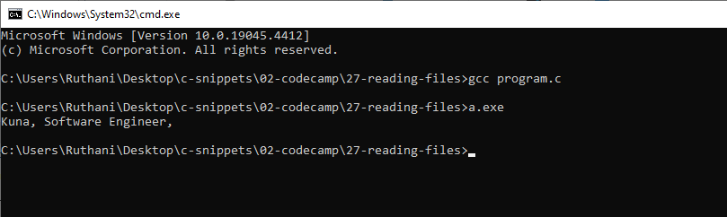