# 02-codecamp Snippets

## 01-hello-world

### Program.c

```c
#include <stdio.h>

int main(){

	printf("Hello World\n");
	return 0;

}

```
### output
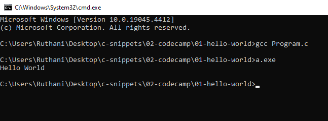

## 02-variable

### Program.c

```c

#include<stdio.h>

int main(){

	char name[] = "kuna";
	int a=10;

	printf("Hello, My name is %s\n",name);
	printf("My age is %d\n",a);

	return 0;


}

```
### output

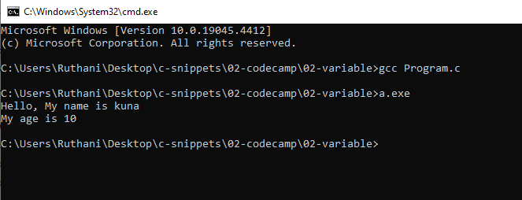

## 03-data-types

### Program.c

```c

#include <stdio.h>

int main(){

	int a=10; //Int stores whole numbers.
	double d=10.5; // point numbers.
	char onev= 'A'; //Stores only one character.

	return 0;

	//These are the basic data types in c.

}

```
### output

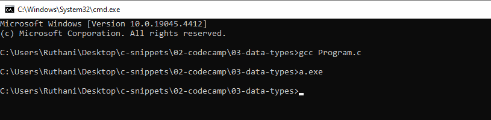

## 04-printf

### Program.c

```c

#include <stdio.h>

int main(){


	printf("My Favoite %s is %d \n","number",500 );
	
}

```
### output

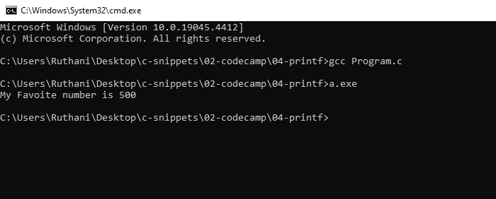

## 05-numbers

### 01-example

#### Program.c

```c

#include<stdio.h>

int main(){

	printf("%f\n", 85.5/2);
	return 0;

}

```
#### output

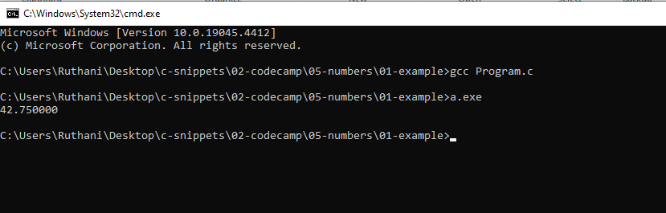

### 02-example

#### Program.c

```c

#include<stdio.h>
#include<math.h>


int main(){


	printf("%f", pow(2,8) ); 
	//sqrt() get the squre root of number.
	//celi() next heighst number.
	//floor() round the number.
	return 0;

}

```
#### output

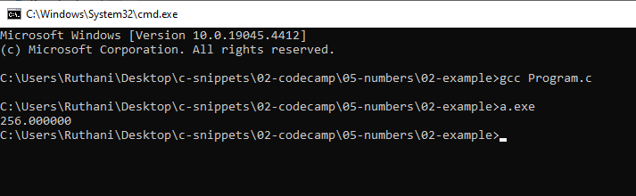

## 07-const

### Program.c

```c

#include <stdio.h>

int main(){

	const int num = 10;//constant variable cannot be changed.
	printf("%d\n",num );
	return 0;
}

```

### output

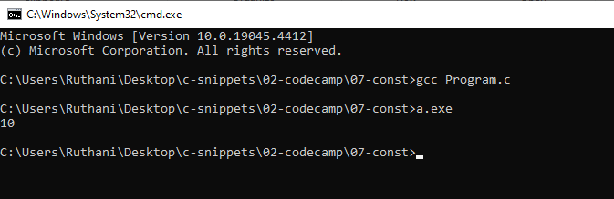

## 08-scanf

### 01-int

#### Program.c

```c

#include<stdio.h>

int main(){

	int age;
	printf("Enter your age:");
	scanf("%d",&age);//& means is pointer.
	printf("You are %d years old\n",age );
	return 0;
}


```

#### output

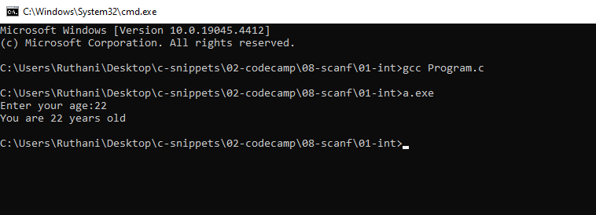

### 02-char

#### Program.c

```c

#include<stdio.h>

int main(){

	char name[10]; //10 character length char variable.
	printf("Enter your name:\n");
	scanf("%s",name); // Do not need to used pointer for char variable.
	printf("Your name is %s\n",name);
	return 0;
}

```

#### output

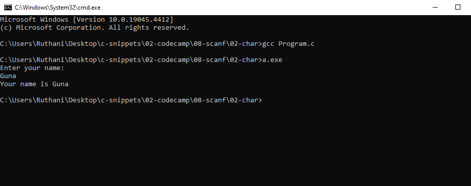

## 09-fgets

### Program.c

```c

#include<stdio.h>

int main(){

	char name[10]; //10 character length char variable.
	printf("Enter your name:\n");
	fgets(name,10,stdin); //name is the variable. 10 is the length.
	//fgets can be used to get multiple words with space.
	printf("Your name is %s\n",name);
	return 0;
}

```

### output

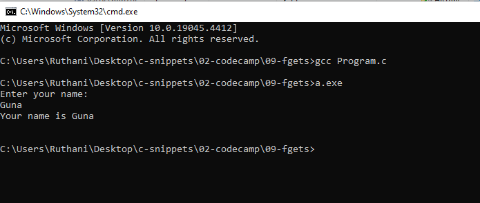

## 10-add-two-numbers

### Program.c

```c

#include<stdio.h>

int main(){

	int num1;
	int num2;
	printf("Enter first number.\n");
	scanf("%d", &num1);
	printf("Enter secound number\n");
	scanf("%d", &num2);

	int total = num1+num2;

	printf("The total value is %d \n",total);

	return 0;

}

```

### output

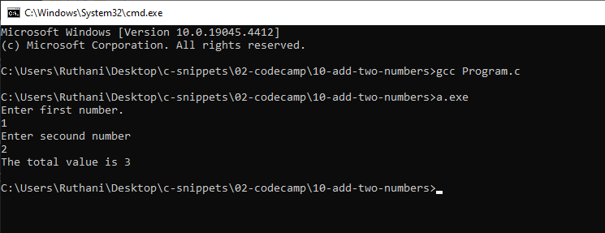

## 11-exercise

### Program.c

```c

#include <stdio.h>

int main(){

	char color[20];
	char pluralNoun[20];
	char celebrity[20];

	printf("Enter a color\n");
	scanf("%s",color);

	printf("Enter a pluralNoun\n");
	scanf("%s",pluralNoun);

	printf("Enter a celebrity\n");
	scanf("%s",celebrity);

	printf("Roses are %s\n",color);
	printf("%s are blue\n",pluralNoun);
	printf("I love %s\n",celebrity);

	return 0;

}


```

### output

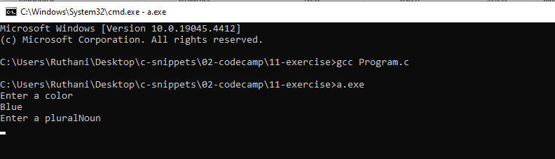

## 12-array

### 01-example

#### Program.c

```c

#include<stdio.h>

int main(){


	int numbers[] ={2,4,16,32,64,128,256};

	printf("%d\n",numbers[0] );

	//modify the 0 element.

	numbers[0] = 200; // replacement took palce.

	printf("%d\n",numbers[0]);

	return 0;

}


```

#### output

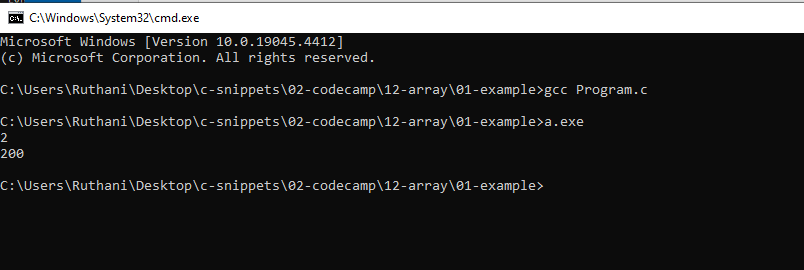

### 02-example

#### Program.c

```c

#include<stdio.h>

int main(){

	int arr[5];

	arr[1]=10;
	arr[0]=1;
	printf("%d\n", arr[0]);
	printf("%d\n",arr[1] );
	return 0;

}


```

#### output

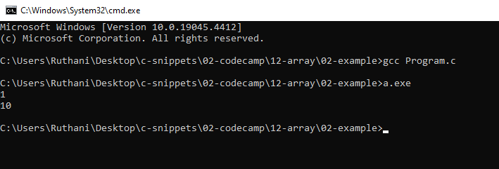