# 03-tutorialspoint

## 01-sizeof,flt_min-and-flt_max

### Program.c

```c

#include <stdio.h>
#include <float.h>

int main(){

   printf("The size of float %d\n", sizeof(float));
   printf("Maximum float value: %e\n",FLT_MAX);
   printf("Minimum float value: %e\n",FLT_MIN);
   
   return 0;
}

```
### output

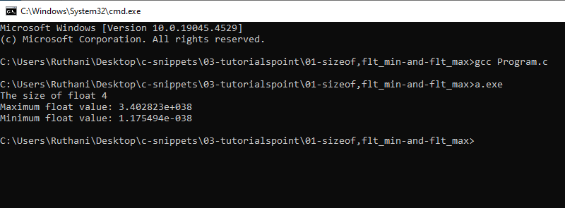

## 02-static

### Program.c

```c

#include <stdio.h>

void decreaser();

int main(){


   for (int i = 0; i < 5; ++i)
   {
      
   
   decreaser();
   
   }
}

void decreaser(){
   
   int static count = 5;  // This static keeps the value safe from being deleted.
   printf("%d\n",count);
   count--;
   
}
```

### output

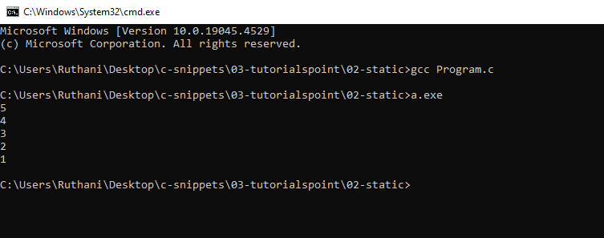

## 03-function

### Program.c

```c

#include <stdio.h>

int max(int a, int b);

int main(){

   int num1=10;
   int num2=5;

   int total;

   total = max(num1,num2);

   printf("Total is: %d\n",total);

   return 0;

}

int max(int a,int b){

   return a+b;

}

```

### output

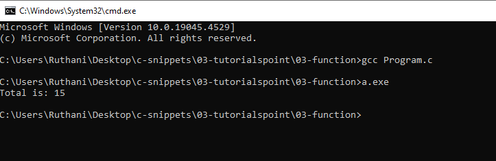

## 04-array

### Program.c

```c

#include <stdio.h>

int main(){

   int nums[10];

   for(int i=0; i<10; i++){

      nums[i] = 100 + i;

   }


   for(int s=0;s<10;s++){

      printf("%d\n",nums[s]);

   }

}

```

### output

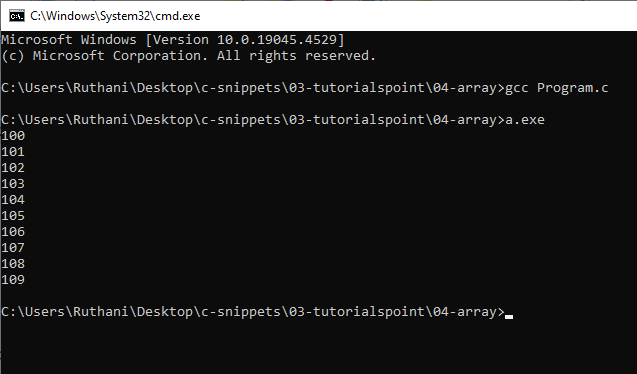

## 05-string

### Program.c

```c

#include <stdio.h>
#include <string.h>

int main () {

   char str1[12] = "Hello";
   char str2[12] = "World";
   char str3[12];
   int  len ;

   /* copy str1 into str3 */
   strcpy(str3, str1);
   printf("strcpy( str3, str1) :  %s\n", str3 );

   /* concatenates str1 and str2 */
   strcat( str1, str2);
   printf("strcat( str1, str2):   %s\n", str1 );

   /* total lenghth of str1 after concatenation */
   len = strlen(str1);
   printf("strlen(str1) :  %d\n", len );

   return 0;
}

```

### output

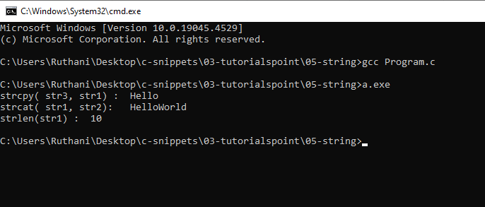

## 06-struct

### 01-example

#### Program.c

```c

#include <stdio.h>
#include <string.h>

struct PERSON
{
   char fname[50];
   char lname[50];
   char dob[50];
   
};


int main(){

   struct PERSON person1;

   strcpy(person1.fname,"Guna");
   strcpy(person1.lname,"Rakualn");
   strcpy(person1.dob,"1997.01.11");

   struct PERSON person2;
   strcpy(person2.fname,"Joeanna");
   strcpy(person2.lname,"Praveena");
   strcpy(person2.dob,"1996.12.17");

   printf("%s\n",person1.fname);
   printf("%s\n",person1.lname);
   printf("%s\n",person1.dob);

   printf("--------------------\n");

   printf("%s\n",person2.fname);
   printf("%s\n",person2.lname);
   printf("%s\n",person2.dob);

   return 0;
}

```

#### output

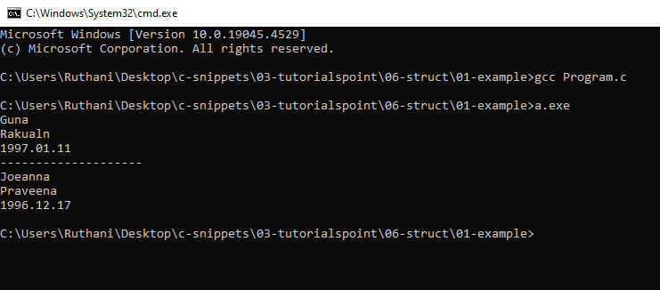

### 02-example

#### Program.c

```c

#include <stdio.h>
#include <string.h>


struct PERSON
{
   char fname[50];
   char lname[50];
   char dob[50];
   
};

void printer(struct PERSON p); // This is function initailation.
// parameter is struct type PERSON.

int main(){

   struct PERSON person1;

   strcpy(person1.fname,"Guna");
   strcpy(person1.lname,"Rakualn");
   strcpy(person1.dob,"1997.01.11");

   struct PERSON person2;
   strcpy(person2.fname,"Joeanna");
   strcpy(person2.lname,"Praveena");
   strcpy(person2.dob,"1996.12.17");

   printer(person1); // call the function.
   printer(person2);

   return 0;
}


void printer(struct PERSON p){ //This is printer function.

   printf("%s\n",p.fname);
   printf("%s\n",p.lname);
   printf("%s\n",p.dob);
   printf("---------------\n");
}

```

#### output

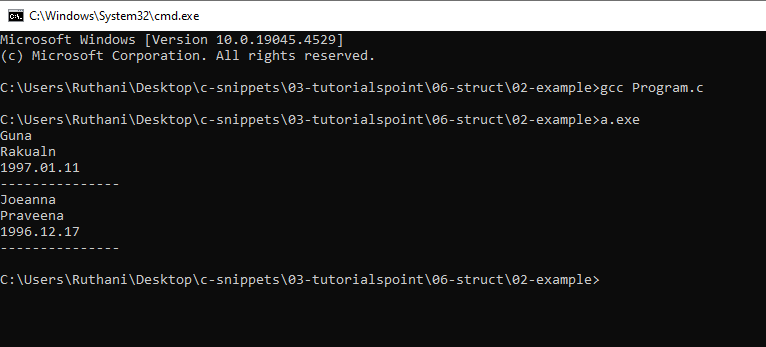

## 07-union

### Program.c

```c

#include <stdio.h>
#include <string.h>

union Data {

   int i;
   float f;
   char str[20];
};

int main(){

   union Data data1;

   data1.i=10;
   printf("%d\n", data1.i);

   data1.f=202.2;
   printf("%d\n",data1.f);

   strcpy(data1.str,"Programming");
   printf("%s\n",data1.str);

   return 0;

}

//we will use one variable at a time which is the main purpose of having unions.
//Union uses one memory location for all data.

```

### output

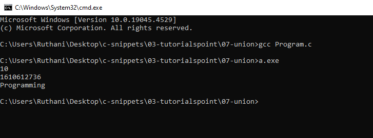

## 08-bit-fields

### Program.c

```c

#include <stdio.h>
#include <string.h>

struct HOME // By default struct has 8 bytes of memory.
{
   
   unsigned int width:1; //unsigned means positive numbers only.
   //width can hold 1 bit of memory. more than that not allowed.

};

int main(){

   struct HOME home1;
   home1.width = 1; 
   printf("%d\n",home1.width);

   return 0;

}

```

### output

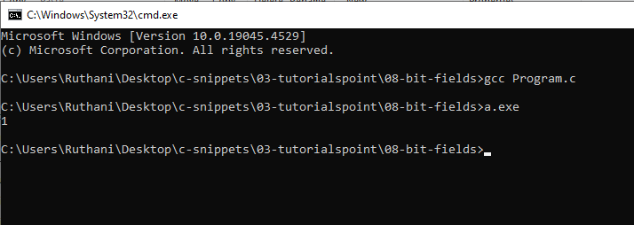

## 09-#define

### Program.c

```c

#include <stdio.h>

#define NAME "Guna" //keep it in mind that, we should not use = (assignment operator) and ; (semicolon) for #define.

//In the C Programming Language, the #define directive allows the definition of macros within your source code.
//These macro definitions allow constant values to be declared for use throughout your code.
//Macro definitions are not variables and cannot be changed by your program code like variables. 

//It is used for numbers, strings or expressions.

int main(){


   printf("%s\n",NAME);
   return 0;

}

```

### output

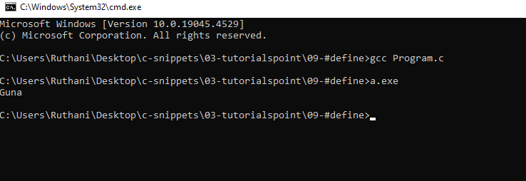

## 10-typedef

### Program.c

```c

#include <stdio.h>

/*typedef is a keyword used in C language to assign alternative names to existing datatypes.
Its mostly used with user defined datatypes,
when names of the datatypes become slightly complicated to use in programs.*/

typedef int hot;  // I have changed the int as hot.
typedef float cold;//I have changed the float as cold.

int main(){

   hot intNum = 10;       //Instead of using int we used hot.
   cold floatNum = 55.55; //

   printf("%d\n",intNum);
   printf("%f\n",floatNum);

   return 0;

}

```

### output

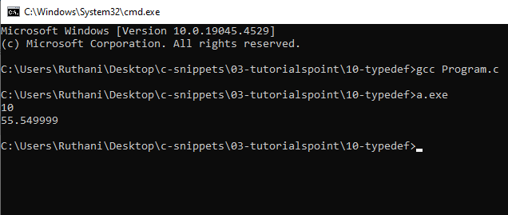

## 11-input-and-output

### 01-getchar()-and-putchar()

#### Program.c

```c

#include <stdio.h>

int main(){

   int c;

   printf("Enter a value");
   c = getchar();
   printf("\n You have entered: ");
   putchar(c);
   return 0;
}

//This reads only one character.


```

#### output

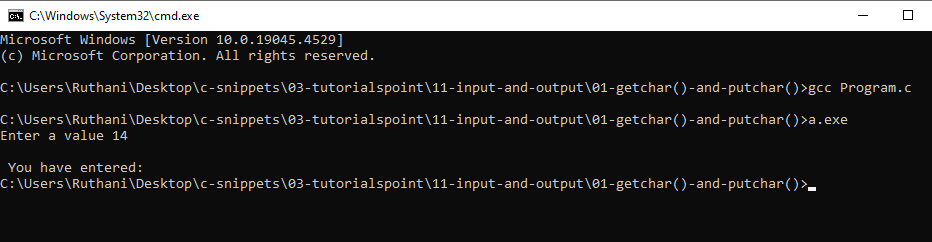

### 02-gets()-and-puts()

#### Program.c

```c

#include <stdio.h>
int main( ) {

   char str[100];

   printf( "Enter a value :");
   gets( str );

   printf( "\nYou entered: ");
   puts( str );

   return 0;
}

//This reads multiple lines.

```

#### output

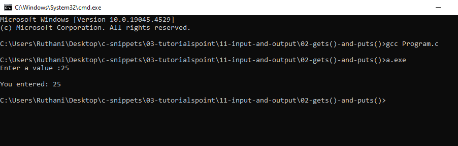

### 03-printf()-and-scanf()

#### Program.c

```c

#include <stdio.h>

int main(){

   char str[100];
   int i;

   printf("Enter a value.");
   scanf("%s %d",str,&i);

   printf("\n You entered %s \n %d",str,i);
   return 0;

}


```

#### output

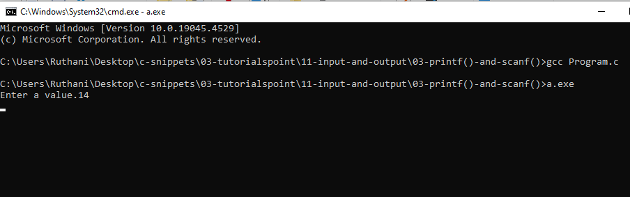

## 12-file-io

### 01-write

#### Program.c

```c

#include <stdio.h>

int main(){

   FILE *fp;

   fp = fopen("text.txt","w+");
   fprintf(fp,"This is testing for fprintf...\n");
   fputs("This is testing for fputs.....\n",fp);
   fclose(fp);
   return 0;
}

```

#### output

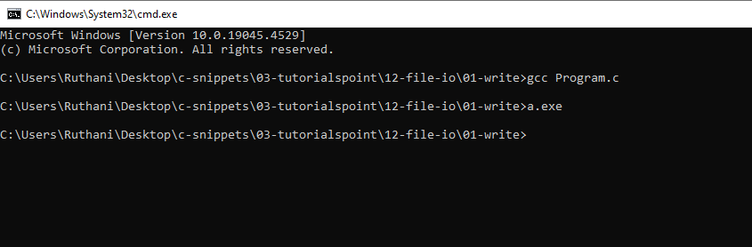

### 02-read

#### Program.c

```c

#include <stdio.h>

int main(){


   FILE *fp;

   char buff[255];

   fp = fopen("text.txt","r");
   fscanf(fp,"%s",buff); 
   printf("1: %s\n",buff);

   fgets(buff,255,(FILE*)fp);
   printf("2: %s\n",buff);

   fgets(buff,255,(FILE*)fp);
   printf("3: %s\n",buff);
   
   fclose(fp);

   return 0;
}

```

#### output

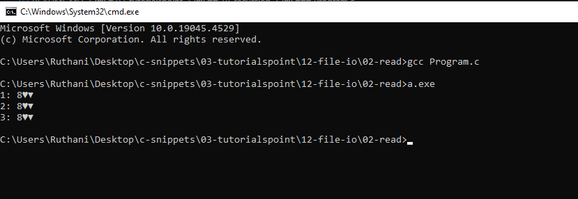

## 13-preprocessor

### Program.c

```c

#include <stdio.h>

int main() {

   printf("File :%s\n", __FILE__ );
   printf("Date :%s\n", __DATE__ );
   printf("Time :%s\n", __TIME__ );
   printf("Line :%d\n", __LINE__ );
   printf("ANSI :%d\n", __STDC__ );

   return 0;
}

```

### output

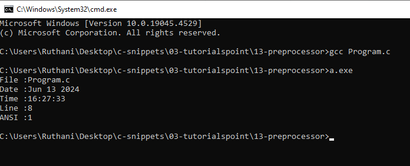

## 14-macros

### 01-continuation

### Program.c

```c

#include <stdio.h>

#define  message_for(a, b)  \
   printf(#a " and " #b ": We love you!\n")

int main(void) {
   message_for(Carole, Debra);
   return 0;
}

```

#### output

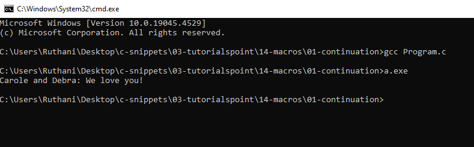

## 16-type-casting

### 01-example

#### Program.c

```c

#include <stdio.h>

int main(){


   int sum = 17, count = 5;
   double mean;

   mean = (double) sum / count;
   printf("Value of mean : %f \n",mean);
   return 0;
   
}

```

#### output

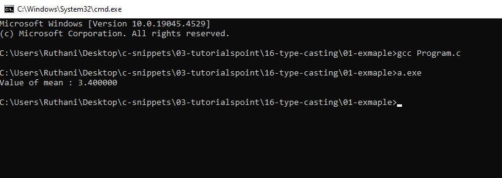

## 17-error-handling

### Program.c

```c

#include <stdio.h>
#include <errno.h>
#include <string.h>

extern int errno ;

int main () {

   FILE * pf;
   int errnum;
   pf = fopen ("unexist.txt", "rb");
   
   if (pf == NULL) {
   
      errnum = errno;
      fprintf(stderr, "Value of errno: %d\n", errno);
      perror("Error printed by perror");
      fprintf(stderr, "Error opening file: %s\n", strerror( errnum ));
   } else {
   
      fclose (pf);
   }
   
   return 0;
}

```

### output

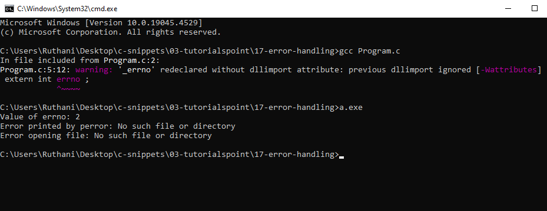

## 18-recursion

### Program.c

```c

#include <stdio.h>

unsigned long long int factorial(unsigned int i) {

   if(i <= 1) {
      return 1;
   }
   return i * factorial(i - 1);
}

int  main() {
   int i = 5;
   printf("Factorial of %d is %d\n", i, factorial(i));
   return 0;
}

```

### output

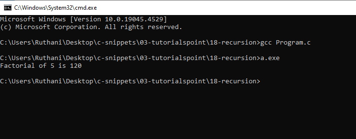